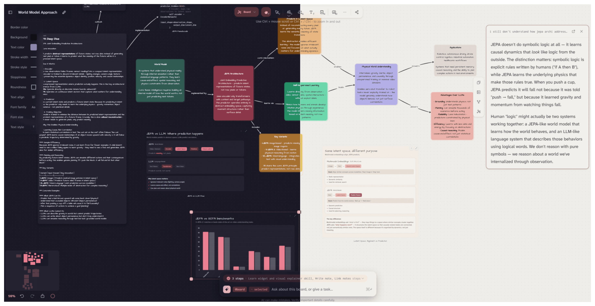
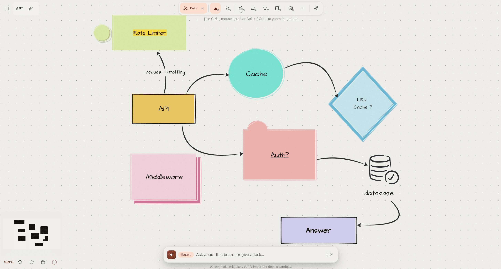
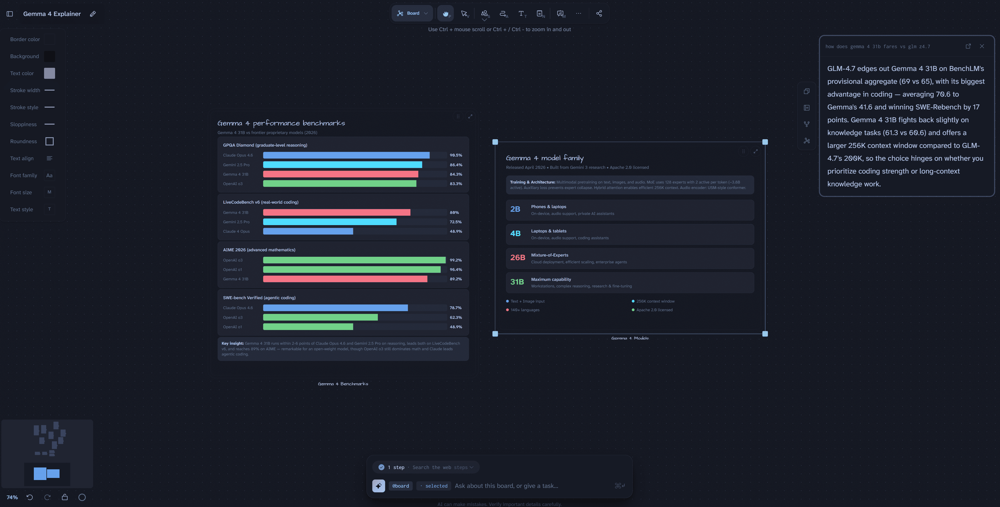
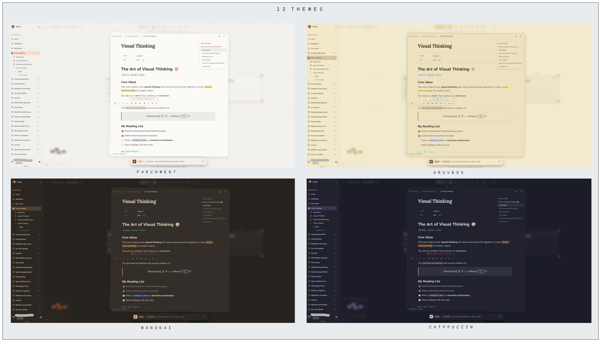

<p align="center">
  
</p>

<h1 align="center">Dim0 - The Thinking Canvas</h1>

<p align="center">
  <a href="https://github.com/vcmf/dim0/releases"></a>
  <a href="https://github.com/vcmf/dim0/actions/workflows/tests.yml"></a>
  <a href="https://github.com/vcmf/dim0/pulse"></a>
  <a href="./LICENSE"></a>
</p>

<p align="center">
  <a href="https://dim0.net">🌐 Website</a> · <a href="https://app.dim0.net">🚀 Live App</a> · 🔒 Privacy-first · 📄 MIT License
</p>

<p align="center">
  
</p>

<p align="center">
  Notes, code, widgets, and documents on one board - and an agent that can read what's on it and write back into it. <strong>Your work is yours: privacy-first, your data stays yours.</strong>
</p>

<p align="center">
  ⭐ Star if Dim0 is useful to you. It helps others find the project.
</p>


*A board with notes, charts, visual explainers, and the agent - all in the same workspace, in light and dark.*

https://github.com/user-attachments/assets/cdc7d3d4-eb59-4d7d-a9ff-6f0206ba82df

## What it is

Most AI tools start with a chat box and bolt the rest of the product on around it. Dim0 goes the other way - the board is the workspace, and the agent is one of the things living on it.

The board holds notes, code sandboxes, widgets, documents, nested boards, and presentation frames, all sitting next to each other. The agent can see what's there, take multiple steps with tools, and drop its results back onto the same canvas.

Things it can do:

- Read the current board and any selected nodes
- Search the web and fetch pages
- Run code in a sandbox
- Create and edit notes
- Generate widgets and small visual explainers
- Save and recall semantic memory

## Node types

Everything on the board is a node:

- **Shapes** - diagrams and spatial structure
- **Notes** - rich text, edited in place
- **Code sandboxes** - write code, run it
- **Widgets** - embedded HTML/JS, charts, visual explainers, interactive tools
- **Documents** - uploaded files, also fed into retrieval
- **Nested boards** - for when one board isn't enough
- **Frames** - turn the canvas into a presentation


*Shapes for diagrams, flowcharts, and spatial layout.*


*Notes are first-class - rich text, math, code, edited in place.*


*Widgets render charts and interactive explainers right on the canvas.*


*Mix shapes and notes to think through a topic spatially.*

https://github.com/user-attachments/assets/ad5de9f4-6f44-43a2-b59a-5279232d7f60

## Canvas engine

The board is built on [canvas-harness](https://github.com/winlp4ever/canvas-harness), a canvas-rendered node-graph library we maintain separately. Boards can hold thousands of nodes and still pan, zoom, and edit smoothly — comparable to tldraw and Excalidraw, and on par with hosted tools like Miro or FigJam.

## Agent layer

Built on the OpenAI Agents SDK, with board-aware tools wired in:

- Board context - current graph and selected nodes
- Notes - create, edit, link
- Web - search and fetch
- Code - run in Daytona-backed sandboxes
- Widgets - generate inline visual outputs
- Memory - semantic store and recall, via Qdrant

Models: OpenAI, Anthropic, Google Gemini, Mistral, Moonshot, DeepSeek, Qwen, Z.ai.


*Ask a question on the board - the agent answers with a widget, a mindmap, or a note, dropped back where you're working.*

## Themes

Light, dark, and a set of paper-and-ink variants. The canvas adapts; so do notes, widgets, and shapes.


*A few of the available themes.*

## Try it

- Hosted: https://app.dim0.net
- Site: https://dim0.net
- Self-host: see below

## Repo layout

- `backend/` - API, agent logic, prompts, model integrations, persistence
- `webui/` - React frontend (canvas, chat, board UX)
- `build/` - Docker Compose and build helpers

## Getting started

### Prerequisites

- Node.js (LTS)
- `uv` for Python deps
- Docker + Docker Compose (recommended for local services)

### Environment

Copy `.env.sample` to `.env` and fill in the keys.

```bash
cp .env.sample .env
```

At minimum, set:

- `OPENAI_API_KEY`
- `MISTRAL_API_KEY`
- `OPENROUTER_API_KEY`
- `LINKUP_API_KEY`

The rest of `.env.sample` covers additional providers and tools.

A couple of things worth knowing:

- Backend and frontend both read the root `.env`
- Only variables prefixed with `VITE_` reach the frontend

### Run published images

```bash
make pull
make run
```

Then open `http://localhost:3000`.

Stop it:

```bash
make down-run
```

Stop it and wipe volumes:

```bash
make kill-run
```

### Run from source

If you'd rather run the source instead of the published images:

#### Local databases

```bash
make up-db
```

#### Backend

```bash
cd backend
uv sync
uv run python -m topix.api.app
```

Port comes from `API_PORT` in `.env` (defaults to `8081`).

#### Frontend

```bash
cd webui
npm install
npm run dev
```

Port comes from `APP_PORT` in `.env` (defaults to `5175`).

## Environment variables

`.env.sample` is the canonical list - ports and origins, model provider keys, search and image provider keys, local service settings, backend auth and tracing. Use it as a checklist when setting things up.

## Docker

Compose stack with Makefile shortcuts.

### Core commands

| Command | What it does |
| --- | --- |
| `make up` | Build if needed and start all services |
| `make up-build` | Rebuild images, then start |
| `make build` | Build images only |
| `make rebuild` | Rebuild without cache |
| `make down` | Stop and remove containers |
| `make kill` | Stop and remove containers, images, and volumes |

### Services and debugging

| Command | What it does |
| --- | --- |
| `make ps` | Show service status |
| `make logs` | Tail logs for all services |
| `make logs-s SERVICE=backend-dev` | Tail logs for one service |
| `make up-s SERVICE=backend-dev` | Start one service |
| `make build-s SERVICE=webui-dev` | Build one service |
| `make restart-s SERVICE=backend-dev` | Rebuild and restart one service |
| `make exec SERVICE=backend-dev CMD="bash"` | Open a shell in a service |

### Databases

| Command | What it does |
| --- | --- |
| `make up-db` | Start only the databases |
| `make down-db` | Stop only the databases |

### Overrides

Override the profile and env file at invocation:

```bash
make up PROFILE=local ENVFILE=.env
```

Or override ports and origins for quick tests:

```bash
make up PROFILE=dev API_PORT=9090 API_HOST_PORT=9090 API_ORIGIN=http://localhost:9090
```

## Images

Public Docker Hub images, for self-hosting:

- `winlp4ever/dim0-backend`
- `winlp4ever/dim0-webui`

```bash
docker pull winlp4ever/dim0-backend:0.1.5
docker pull winlp4ever/dim0-webui:0.1.5
```

To run them locally, use the `make pull` / `make run` flow above.

## Versioning

One semver for the whole product. The repo-root `VERSION` file is the source of truth, and release tooling syncs it into:

- `backend/pyproject.toml`
- `webui/package.json`
- `webui/src-tauri/Cargo.toml`

Bumps use Commitizen with Conventional Commits.

```bash
make version-check
make version-sync
make version-bump
```

GitHub Actions handle the version check, releases, and Docker publishing.

## Troubleshooting

- Frontend can't reach the API? Check `VITE_API_URL` in `.env`.
- Port already in use? Change `API_PORT` or `APP_PORT`.
- Env change not picked up? Restart backend and frontend after editing `.env`.
- Want to see the resolved Compose config? `make config`.
- Backend tests failing with odd import errors (e.g. `cannot import name 'Docstring' from 'griffe'`)? The local `backend/.venv` is stale or half-installed — a plain `uv sync` won't repair a partially-deleted package. Rebuild it: `rm -rf backend/.venv && uv sync --extra dev`.

## License

MIT.
