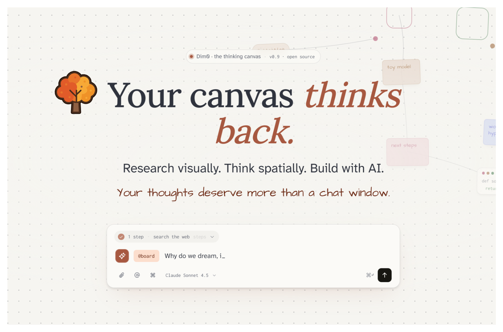
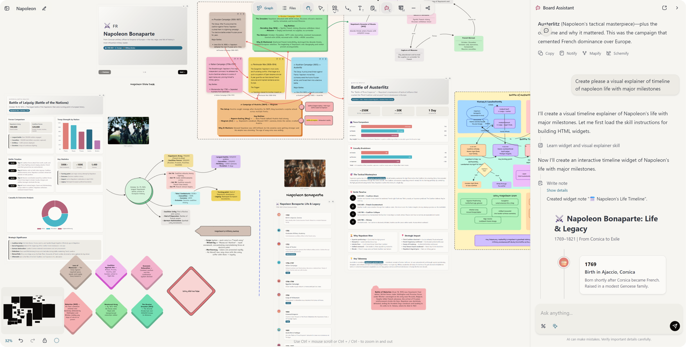
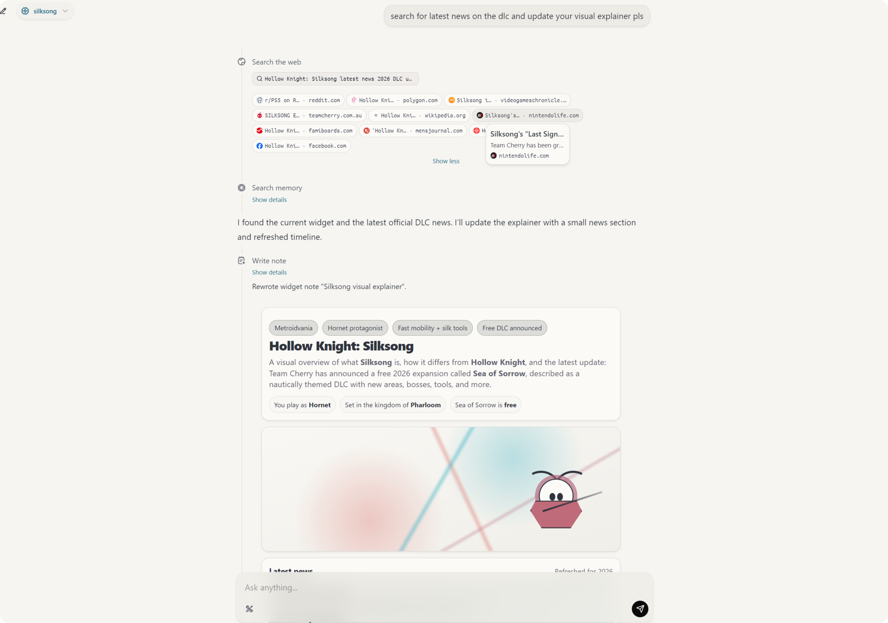

<p align="center">
  
</p>

<h1 align="center">Dim0 - The Thinking Canvas</h1>

<p align="center">
  An agent-native canvas where notes, code, charts, visual explainers, widgets, documents and AI work together on one board.
</p>

<p align="center">
  <a href="https://dim0.net">🌐 Website</a> · <a href="https://app.dim0.net">🚀 Live App</a> · 📄 MIT License
</p>

<p align="center">
  ⭐ Star if Dim0 is useful to you. It helps others find the project.
</p>


*Canvas workspace: notes, charts, visual explainers, and AI agent on the same board.*

https://github.com/user-attachments/assets/ffc280f2-5fcc-4ecc-aa66-87380f516f8f


*Assistant performs multi-reasoning steps with tool calls.*

## 🧠 What Dim0 Is

Dim0 is built around one architectural bet: **the canvas, not the chat, should be the primary interface for thinking with AI.**

Many tools treat AI as an add-on to the main product. Dim0 is built the other way around: the board is a powerful workspace in its own right, with notes, code, widgets, nested boards, presentation frames, and documents living side by side, and it is built for an agent that can read context, use tools, and write results directly back into that workspace.

The agent is not just a chatbot. It can:

- Read live board context and selected nodes
- Reason across multiple steps with tool use
- Search the web and execute code
- Create and edit notes directly on the board
- Generate widgets and visual outputs inside the canvas

## 🧩 Node Types

https://github.com/user-attachments/assets/52f70d3f-8ca6-41d7-9d37-aa05f97b0fe2

Everything on the board is a node. Dim0 supports:

- 🔷 Shape nodes for diagrams and spatial structure
- 📝 Rich text notes for writing and editing inside the board
- 💻 Code sandbox nodes for writing and running code
- 📊 Widget nodes for embedded HTML/JS outputs like charts, visual explainers, and interactive tools
- 📄 Document nodes for uploaded files and retrieval context
- 🗂️ Nested boards for hierarchical organization
- 🎞️ Frame-based presentation directly from the canvas

## 🤖 Agent Layer

The assistant layer is built on the OpenAI Agents SDK and board-aware tools. It can work with:

- 🧭 Board context from the current graph and selected nodes
- ✍️ Note creation and editing tools
- 🔎 Web search and fetch tools
- 🧪 Code execution via Daytona-backed sandboxes
- 🎨 Widget and visual output generation
- 🧠 Semantic storage and retrieval backed by Qdrant

Model support includes OpenAI, Anthropic, Google Gemini, Mistral, Moonshot, DeepSeek, Qwen, and Z.ai.

## 🚀 Try It

- **Hosted app:** https://app.dim0.net
- **Website:** https://dim0.net
- **Self-host:** follow the setup below

## 🏗️ Monorepo Structure

This repository contains the full Dim0 product stack:

- `backend/`: API, agent logic, prompts, model integrations, persistence
- `webui/`: React frontend for the canvas, chat, and board UX
- `build/`: Docker Compose and build-related assets

## ⚡ Getting Started

### 📋 Prerequisites

- Node.js (LTS recommended)
- `uv` for Python dependency management
- Docker + Docker Compose (optional, recommended for local services)

### 🔧 Environment Setup

Before running Dim0, create a root `.env` from `.env.sample` and review the variables there:

```bash
cp .env.sample .env
```

At minimum, set:

- `OPENAI_API_KEY`
- `MISTRAL_API_KEY`
- `OPENROUTER_API_KEY`
- `LINKUP_API_KEY`

Additional providers and tools can be enabled through the rest of `.env.sample`.

Important notes:

- Backend and frontend both read the root `.env`
- Only variables prefixed with `VITE_` are exposed to the frontend

### 🐳 Run Published Images

Pull and start the published stack:

```bash
make pull
make run
```

Open `http://localhost:3000`.

Stop it:

```bash
make down-run
```

Stop it and remove volumes:

```bash
make kill-run
```

### 🛠️ Local Development

If you want to run the source code locally instead of the published images, use the steps below.

#### 🗄️ Start Local Databases

```bash
make up-db
```

#### Backend

```bash
cd backend
uv sync
uv run python -m topix.api.app
```

The backend uses `API_PORT` from `.env` and defaults to `8081`.

#### Frontend

```bash
cd webui
npm install
npm run dev
```

The frontend uses `APP_PORT` from `.env` and defaults to `5175`.

## 🔐 Environment Variables

The root `.env.sample` is the source of truth for available configuration.
It includes app ports and origins, model provider keys, search and image provider keys, local service settings, and backend auth and tracing options.

Use it as a checklist when setting up your local environment.

## 🐳 Docker and Deployment

Deployment and local services are managed through Docker Compose with Makefile shortcuts.

### Core Commands

| Command | What it does |
| --- | --- |
| `make up` | Build if needed and start all services |
| `make up-build` | Rebuild images, then start all services |
| `make build` | Build images only |
| `make rebuild` | Rebuild images without cache |
| `make down` | Stop and remove containers |
| `make kill` | Stop and remove containers, images, and volumes |

### Service and Debug Commands

| Command | What it does |
| --- | --- |
| `make ps` | Show service status |
| `make logs` | Tail logs for all services |
| `make logs-s SERVICE=backend-dev` | Tail logs for one service |
| `make up-s SERVICE=backend-dev` | Start one service |
| `make build-s SERVICE=webui-dev` | Build one service |
| `make restart-s SERVICE=backend-dev` | Rebuild and restart one service |
| `make exec SERVICE=backend-dev CMD="bash"` | Open a shell in a service |

### Database Shortcuts

| Command | What it does |
| --- | --- |
| `make up-db` | Start only database services |
| `make down-db` | Stop only database services |

### Useful Overrides

You can override the compose profile and env file at invocation time:

```bash
make up PROFILE=local ENVFILE=.env
```

You can also override ports and origins for quick tests:

```bash
make up PROFILE=dev API_PORT=9090 API_HOST_PORT=9090 API_ORIGIN=http://localhost:9090
```

## 📦 Docker Images

This repo can publish public Docker Hub images for self-hosting:

- `winlp4ever/dim0-backend`
- `winlp4ever/dim0-webui`

Example:

```bash
docker pull winlp4ever/dim0-backend:0.1.5
docker pull winlp4ever/dim0-webui:0.1.5
```

You can also run the published images locally:

```bash
make pull
make run
make down-run
make kill-run
```

## 🔖 Versioning

Dim0 uses one shared semantic version for the whole product. The source of truth is the repo-root `VERSION` file, and release tooling syncs that version into:

- `backend/pyproject.toml`
- `webui/package.json`
- `webui/src-tauri/Cargo.toml`

Version bumps use Commitizen with Conventional Commits.

Useful commands:

```bash
make version-check
make version-sync
make version-bump
```

The repository also includes GitHub Actions workflows for version checks, releases, and Docker publishing.

## Troubleshooting

- If the frontend cannot reach the API, check `VITE_API_URL` in `.env`
- If ports are already in use, change `API_PORT` or `APP_PORT`
- If env changes are not applied, restart the backend and frontend after editing `.env`
- Use `make config` to inspect the fully resolved Compose configuration

## License

This repository is available under the MIT License.
